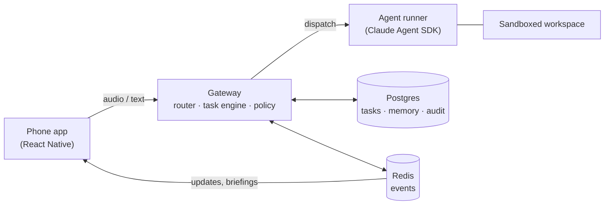

# Architecture

The shape of the system. Deep cuts: [system-design.md](system-design.md) for components and sequences, [data-model.md](data-model.md) for schemas, [code-sketches.md](code-sketches.md) for pseudocode.

## Two loops

Two subsystems with opposite requirements, glued at a narrow seam.

The **voice loop** must answer in about a second, be interruptible, and lose nothing important on crash. The **agent loop** runs for minutes or hours, must survive reboots, and needs an audit trail more than speed.

They meet in exactly two places: a task store (Postgres) and an event stream (Redis feeding websockets). The voice side never runs work — it creates, steers and narrates tasks. Agents never talk to the user — they emit structured progress events that become speech or push notifications.

## Components

**App** — the only client for now. Push-to-talk, live transcript, task list, approval prompts, playback of spoken replies. Audio streams to the gateway over a websocket; the phone reaches the gateway over Tailscale only. Push notifications carry "task finished" and "needs approval" so the app doesn't have to stay open.

**Gateway** — one FastAPI process on the home machine. Modules: router (fast model with a handful of tools — answer, create task, continue task, status, cancel), task state machine, memory service, policy engine, notifier. Modules, not microservices. The seams matter; the network boundaries don't yet.

**Runners** — wrap the Claude Agent SDK. One session per task, resumable, pinned to its workspace. Agents get an MCP toolset for progress reports, artifacts, approval requests, and writing a two-sentence spoken summary at close. The summary the user hears is written by the agent that did the work, not reconstructed from logs.

**Speech** — a cascade: streaming STT in, fast model, streaming TTS out. Server-side, so the app stays thin and vendors stay swappable. Realtime speech-to-speech APIs cost too much for a system idle 95% of the day and lock the brain model; ruled out for now.

## Invariants

Written down so they don't erode:

1. One agent session per task. No shared long-lived session.
2. Every state change is an append-only event. Dashboard, notifications and status queries read the same stream.
3. Approvals are database rows with expiry. Pushing code, messaging anyone, spending money: approval required every time, regardless of accumulated trust.
4. Untrusted code (other people's repos) runs in containers holding zero credentials. Prompt injection is assumed; the design's job is to make it boring.
5. The assistant cannot edit its own policy rules. Policy config lives outside every workspace it can touch.
6. Nothing listens on a public interface.
