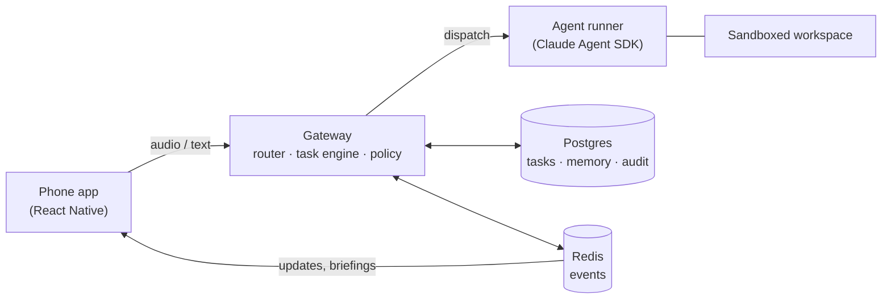

# Architecture

High level on purpose. Numbers, schemas and code sketches live in my working notes; this is the shape of the thing, which is the part I want feedback on.

## Two loops

The core realization: this is two systems with opposite needs glued together.

The **voice loop** has to answer in about a second, be interruptible, and lose nothing important if it crashes. The **agent loop** runs for minutes or hours, has to survive reboots, and needs an audit trail more than it needs speed.

They meet in exactly two places: a task store (Postgres) and an event stream (Redis feeding websockets). The voice side never runs work, it only creates, steers and narrates tasks. The agents never talk to the user, they emit structured progress events that the voice side turns into speech or a push notification.

## The pieces

**The app** is the only client for now. Push-to-talk button, live transcript, task list, approval prompts, and playback of spoken replies. Audio streams to the gateway over a websocket; the phone reaches the gateway over Tailscale, never the open internet. Push notifications carry the "task finished" and "needs your ok" moments so the app doesn't have to stay open.

**The gateway** is one FastAPI process on my home machine. Inside it: a router (a fast model with a handful of tools — answer, create task, continue task, status, cancel), the task state machine, a memory service, a policy engine, and a notifier. These are modules, not microservices. The seams matter, the network boundaries don't yet.

**The runners** wrap the Claude Agent SDK. One session per task, resumable, pinned to the workspace it started in. Agents get an MCP toolset for reporting progress, saving artifacts, requesting approvals and writing their own two-sentence spoken summary at the end. That last one matters: the thing you hear was written by the agent that did the work, not reconstructed later from logs.

**Speech** is a cascade: streaming STT in, fast model, streaming TTS out. Server-side, so the app stays thin and the vendors stay swappable. Realtime speech-to-speech APIs sound great but cost too much for something idle 95% of the day, and I'd lose the ability to pick my own brain model.

## Rules I'm not breaking

A few lines I've decided are load-bearing, so they're written down where I can't quietly ignore them:

1. One agent session per task. No god-session that slowly accumulates confusion.
2. Every state change is an append-only event. The dashboard, the notifications and "what are you working on?" all read the same stream.
3. Approvals are database rows with expiry, not popups. Pushing code, messaging anyone, spending money: approval required, every time, no matter how much I trust it this week.
4. Untrusted code (other people's repos) runs in containers holding zero credentials. Prompt injection will happen; the design's job is to make it boring.
5. The assistant can never edit its own policy rules. Config lives outside every workspace it can touch.
6. Nothing listens on a public interface. Ever.
