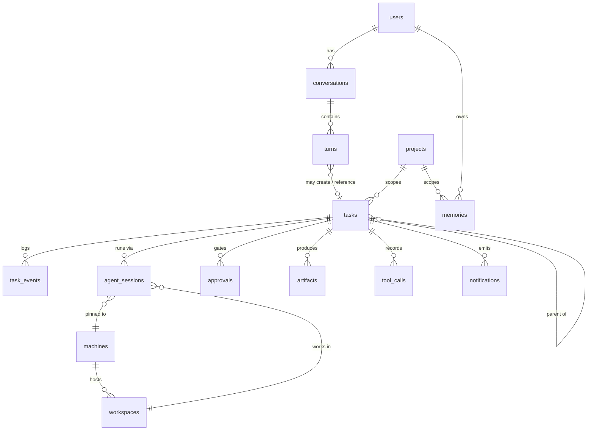

# Data model

Fifteen tables, Postgres throughout, pgvector on `memories`. Single user, but `users` exists anyway — costs nothing now, makes every later option additive.



```sql
create table users (
  id uuid primary key default gen_random_uuid(),
  name text not null,
  preferences jsonb not null default '{}'   -- spoken style, quiet hours, default model tier
);

create table machines (
  id uuid primary key default gen_random_uuid(),
  name text unique not null,                -- "macbook", "hetzner-1"
  kind text not null check (kind in ('local','ssh','container_host')),
  address text, ssh_user text, ssh_key_ref text,   -- secret NAME, never the key
  runner_url text,                          -- thick-remote daemon endpoint (tailnet)
  capabilities jsonb not null default '{}',
  status text not null default 'unknown',
  last_seen_at timestamptz
);

create table projects (
  id uuid primary key default gen_random_uuid(),
  name text unique not null,
  repo_url text, default_machine_id uuid references machines(id),
  notes_path text,                          -- workspace NOTES.md
  metadata jsonb not null default '{}'
);

create table workspaces (
  id uuid primary key default gen_random_uuid(),
  machine_id uuid not null references machines(id),
  project_id uuid references projects(id),
  path text not null,
  isolation text not null default 'sandbox'
    check (isolation in ('sandbox','container','none')),
  approved boolean not null default false,  -- the T1 scope flag
  unique (machine_id, path)
);

create table conversations (
  id uuid primary key default gen_random_uuid(),
  user_id uuid not null references users(id),
  started_at timestamptz not null default now(),
  summary text                              -- nightly distiller fills this
);

create table turns (
  id uuid primary key default gen_random_uuid(),
  conversation_id uuid not null references conversations(id),
  role text not null check (role in ('user','assistant')),
  text text not null,
  audio_ref text,
  heard_fraction real,                      -- how much of a reply survived barge-in
  task_id uuid,
  created_at timestamptz not null default now()
);

create table tasks (
  id uuid primary key default gen_random_uuid(),
  user_id uuid not null references users(id),
  project_id uuid references projects(id),
  parent_task_id uuid references tasks(id),
  title text not null,                      -- short and speakable
  spec jsonb not null,                      -- goal, constraints, model, budgets
  state text not null default 'created' check (state in
    ('created','planning','waiting_approval','running','blocked',
     'paused','failed','completed','cancelled')),
  blocked_reason text,
  spoken_summary text,                      -- 1–2 sentences, agent-written at close
  budget jsonb not null default '{}',
  spent jsonb not null default '{}',
  created_at timestamptz not null default now(),
  last_activity_at timestamptz not null default now()
);
create index on tasks (state, last_activity_at desc);

create table task_events (                   -- append-only; THE task history
  id bigint generated always as identity primary key,
  task_id uuid not null references tasks(id),
  type text not null,  -- state_change|plan|progress|approval_requested|artifact|error|note
  payload jsonb not null,
  created_at timestamptz not null default now()
);

create table agent_sessions (
  id uuid primary key default gen_random_uuid(),
  task_id uuid not null references tasks(id),
  runtime text not null default 'claude-agent-sdk',
  external_session_id text not null,        -- the SDK's session id
  machine_id uuid not null references machines(id),
  workspace_id uuid not null references workspaces(id),
  model text not null,
  status text not null default 'active',    -- active|closed|abandoned
  closeout jsonb,                           -- summary, decisions, next steps, files touched
  cost_usd numeric(10,4) not null default 0,
  started_at timestamptz not null default now(), closed_at timestamptz
);

create table approvals (
  id uuid primary key default gen_random_uuid(),
  task_id uuid not null references tasks(id),
  action text not null,                     -- "git push origin main"
  detail jsonb not null,
  risk_tier text not null check (risk_tier in ('T2','T3')),
  status text not null default 'pending'
    check (status in ('pending','approved','denied','expired')),
  decided_via text,                         -- voice|app|push
  requested_at timestamptz not null default now(),
  expires_at timestamptz, decided_at timestamptz
);

create table memories (
  id uuid primary key default gen_random_uuid(),
  user_id uuid not null references users(id),
  scope text not null check (scope in ('user','project','task')),
  project_id uuid references projects(id),
  type text not null,                       -- preference|fact|decision|reference
  content text not null,                    -- one atomic fact
  embedding vector(1024),
  confidence real not null default 0.8,
  source_kind text, source_id uuid,
  superseded_by uuid references memories(id),
  created_at timestamptz not null default now(),
  last_confirmed_at timestamptz, last_retrieved_at timestamptz
);
create index on memories using hnsw (embedding vector_cosine_ops);

create table artifacts (
  id uuid primary key default gen_random_uuid(),
  task_id uuid not null references tasks(id),
  kind text not null,                       -- report|file|diff|log|link
  name text not null, uri text not null,
  media_type text, size_bytes bigint, digest text,
  created_at timestamptz not null default now()
);

create table tool_calls (                    -- the audit black box
  id bigint generated always as identity primary key,
  task_id uuid references tasks(id),
  session_id uuid references agent_sessions(id),
  machine_id uuid references machines(id),
  tool text not null,
  input_digest jsonb not null,               -- secrets already redacted
  policy_decision text not null,             -- allowed|allowed_by_rule:X|approved:id|denied
  exit_code int, duration_ms int, output_ref text,
  created_at timestamptz not null default now()
);

create table notifications (
  id uuid primary key default gen_random_uuid(),
  user_id uuid not null references users(id),
  task_id uuid references tasks(id),
  kind text not null,                        -- milestone|approval|completed|failed
  spoken text, body text,
  channel text,                              -- voice|push|app
  status text not null default 'queued',
  created_at timestamptz not null default now(), delivered_at timestamptz
);
```

Two deliberate absences: no `steps` table (plans are events — see [task-engine.md](task-engine.md)) and no `secrets` table (the DB stores secret *names*; values live in the broker). The `heard_fraction` column on turns is tiny but load-bearing: it's what makes barge-in conversationally honest.
