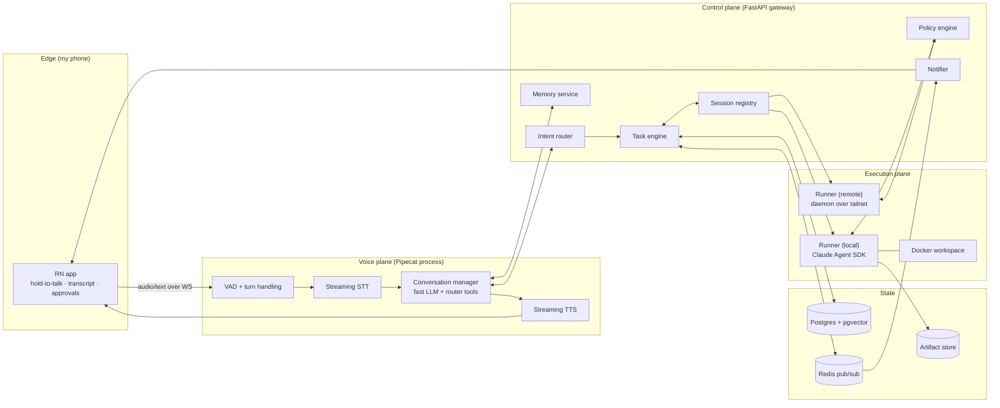
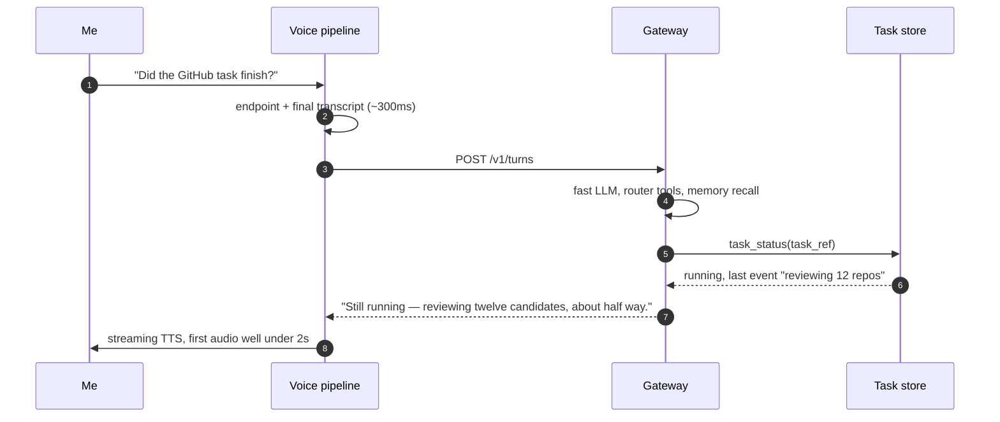

# System design

The detailed version of [architecture.md](architecture.md). Seven services, one database, one queue. Everything below the voice plane is a deliberately boring backend: the exotic parts (models, speech, agents) are all rented, so the parts I own should be dull and debuggable.

## Components



## Where things run

| Component | Runs on | Notes |
|---|---|---|
| App | My phone | Thin client; reaches the gateway over Tailscale only |
| Voice pipeline | Home-base machine | One Pipecat process, stateless, restart freely |
| Gateway (router, tasks, sessions, memory, policy, notifier) | Home-base machine | One FastAPI process; these are modules, not microservices |
| Postgres, Redis | Home base, docker compose | The only stateful infrastructure |
| Local runner | Home base | Spawned per task, workspace-scoped, Docker-wrapped for untrusted work |
| Remote runner | Each enrolled SSH box | Small daemon, installed once |
| Web dashboard | Served by the gateway | For deep review on a laptop; the app is the daily surface |

Two OS processes (voice, gateway) plus compose. The module seams below matter; network boundaries between them don't, yet.

## API boundaries I'm keeping sacred

Even inside a monolith, because they become network boundaries later:

- **App/voice ↔ gateway**: `POST /v1/turns` (final transcript in, `{speak, action_taken, task_ref}` out) plus a websocket for proactive announcements. The voice side knows nothing about tasks.
- **Gateway ↔ runners**: `start(task_spec)` / `send(session_id, message)` / `interrupt` / `status`. A runner knows nothing about voice, memory or other tasks.
- **Runner ↔ agent**: the Agent SDK boundary. The runner passes prompt, workspace, MCP servers and a `can_use_tool` policy callback; it gets back a structured message stream. The agent also gets a `taskboard` MCP server (`report_progress`, `request_approval`, `save_artifact`, `remember`, `complete`) — that's how agent work becomes user-visible state, instead of me parsing prose.
- **Everything → events**: every state change is an append-only `task_events` row plus a Redis publish. App badges, spoken briefings and "what are you working on?" all read the same stream.

## Sequence: a simple question

Must feel instant, never touches an agent.



## Sequence: a long task

```mermaid
sequenceDiagram
  autonumber
  participant U as Me
  participant V as Voice pipeline
  participant G as Gateway
  participant R as Runner
  participant A as Agent session
  U->>V: "Find a GitHub project I can contribute to"
  V->>G: POST /v1/turns
  G->>G: route → long-running task, enqueue
  G-->>V: "I'll research projects that match your skills."
  Note over U,V: conversation over; everything below is async
  G->>R: dispatch(task)
  R->>A: SDK query(prompt, workspace, policy callback, taskboard MCP)
  A->>R: report_progress("shortlisted 12 repos")
  A->>R: save_artifact(report.md) + spoken summary
  R->>G: state → completed
  G->>V: announce if I'm around, else push
  V->>U: "Three matches. Best is X — beginner-friendly issues, active maintainers. Clone it?"
  U->>V: "Yes, set it up"
  V->>G: follow-up turn
  G->>R: resume same session, new instruction
```

Two details carry most of the product feel. The acknowledgment is generated *before* the task is enqueued — speech never waits on infrastructure. And the completion line is written by the agent itself as a structured `spoken_summary` field at close-out, so nothing has to re-summarize a giant transcript at announcement time.
