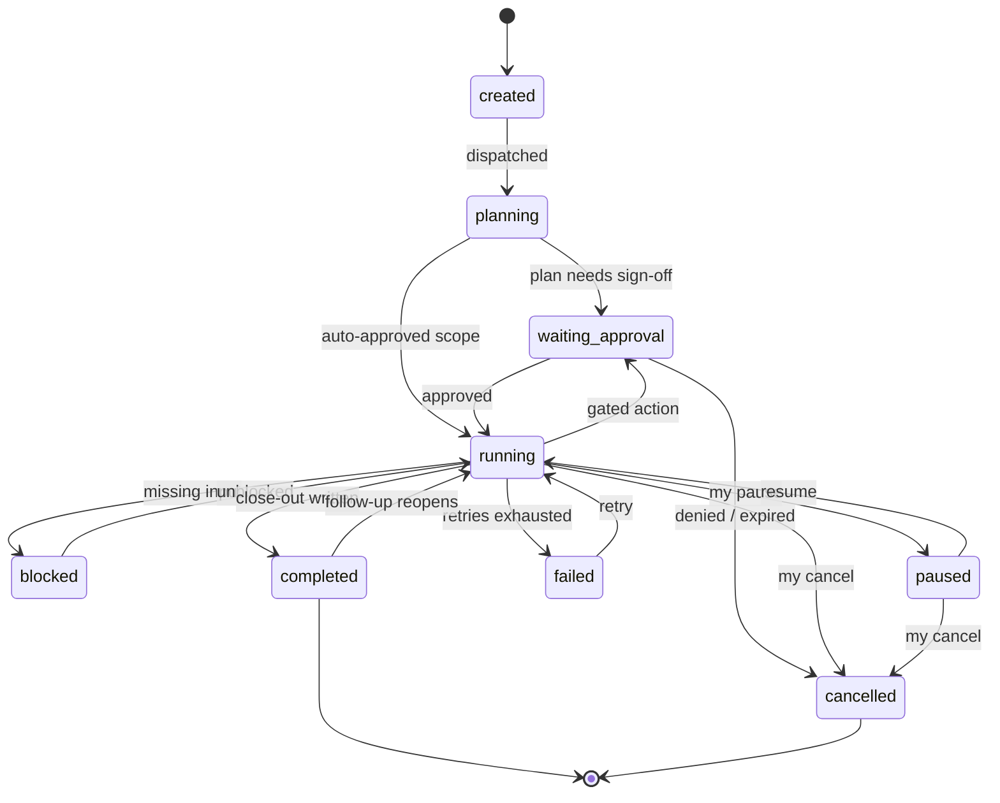

# Task engine

A custom state machine on Postgres — roughly 500 lines I'll fully understand at 2am — rather than a workflow engine.

## Why not an off-the-shelf engine

| Option | Verdict |
|---|---|
| Temporal | The gold standard for durable execution and the wrong first move: server + workers + its programming model is heavy operational buy-in for "workflows" that are mostly one long agent call with checkpoints. The SDK session file already provides the durable resume that's Temporal's headline feature. Adopt later if tasks become genuinely multi-step across services |
| LangGraph | Checkpointing and interrupts map well conceptually, but it wants to own the agent loop — and my agent loop is the Agent SDK, which owns it better. Two competing runtime abstractions is worse than either alone |
| Celery / BullMQ | Task *queues*, not task *lifecycles* — no approvals, no pause/resume semantics, and I'd still be writing the state machine |
| Prefect | Shaped for data pipelines, not conversational, steerable, approval-gated agent processes |
| DBOS | The honorable mention: durable execution as an embedded library on Postgres, no extra server. If I later want checkpointed multi-step workflows, this is the graduation path before Temporal |

The honest trade: I own crash-recovery correctness. Contained, because every transition is a DB write and workers are stateless supervisors of resumable sessions.

## Lifecycle

Semantics worth pinning: *blocked* means the task can't proceed and knows why (`blocked_reason` is user-facing — it answers "why is it stuck?"). *Paused* is only ever me. *Failed* is terminal-unless-retried, and a retry either resumes the session ("try again, network's back") or restarts fresh from the spec ("that approach was wrong"). *Completed* reopens for follow-ups — conversations with results are the signature move, so completion is a checkpoint, not a tombstone.

## Mechanics

- **Transitions are guarded DB updates.** One `transition(task_id, from, to, event)` function enforces the legal edges, writes the task row and the event append in one transaction, publishes to Redis. Everything goes through it — app buttons, voice commands, agent callbacks. Illegal transitions surface as bugs immediately instead of corrupting state.
- **Queueing is `SELECT … FOR UPDATE SKIP LOCKED`** on the tasks table. At one-user scale this is bulletproof and transactional with the state it dispatches. Redis stays pub/sub only.
- **Steps are emergent, not pre-planned.** Coding agents plan adaptively; forcing a rigid step DAG up front fights the tool. The agent's plan is captured as a `plan` event and progress events reference plan items — "current step" reporting without a brittle workflow definition. Multi-agent pipelines are separate tasks linked by `parent_task_id`.
- **Failure handling.** Worker crash → heartbeat timeout → `failed(worker_lost)`, eligible for auto-resume since the session file survives. Agent-reported failure → close-out says what was tried; one auto-retry for transient classes, otherwise wait for me. Runaway protection: per-task budgets (tokens, wall clock, dollars) enforced by the runner; breach → `blocked(budget)`, never silent continuation.
- **Approvals are rows, not callbacks.** The runner holds the SDK permission callback open ~2 minutes against Redis for fast approvals from the phone; past that it denies-with-message, the task parks in `waiting_approval`, and a later approval resumes the session and replays the request. A voice "yes" is only accepted for the specific pending action read back to me.
- **Artifacts.** Anything worth keeping goes through `save_artifact` (copied to the store, row written, event emitted). The final report is just a well-known artifact plus the separate two-sentence `spoken_summary` — the dual register (short spoken, full written) falls out of the schema.
